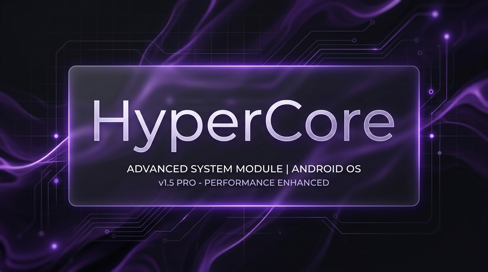

<p align="center">
  
</p>

<h1 align="center">HyperCore</h1>

<p align="center">
  <a href="LICENSE"></a>
  
  
  
  
  
  
  
</p>

<p align="center">
  <i>A lightweight background daemon and universal kernel tuning module tailored for MediaTek MT6789 Family devices.</i><br>
  <i>Inspired by encore @Rem01Gaming</i>
</p>

---

## Overview

Android devices often experience frame drops or scrolling stutters due to conservative CPU/GPU scaling and governor delays. HyperCore runs a native C daemon (`libhypercore.so`) in the background to dynamically tune CPU governors, uclamp targets, Mali GPU devfreq scaling, MediaTek GED/FPSGO drivers, storage read-ahead queues, and thermal limits based on real-time workload state.

---

## Key Features

<details>
<summary><b>✨ Click to expand / collapse Key Features list</b></summary>

<br>

- **Universal Dual-Kernel Architecture**: Seamless support across Linux Kernel 5.10 to 6.12+ GKI (Android 12 to 16) with Cgroup v1 (`/dev/cpuset/`) and Cgroup v2 (`/sys/fs/cgroup/`) sysfs fallback drivers.
- **Atomic Telemetry Teleportation**: Atomic status file updates (`status.json`) paired with multi-tier WebUI resilience to eliminate telemetry flicker.
- **Read-Before-Write Sysfs Cache**: Prevents unnecessary sysfs file writes by verifying existing node values before writing.
- **Event-Driven Screen & Battery Watcher (`inotify` & `netlink`)**: Monitors display state via `inotify` on backlight nodes and battery events via kernel `netlink` sockets for immediate state transitions.
- **Non-Blocking Execution Engine**: Uses POSIX process management to keep the main daemon loop non-blocking with zero dynamic heap allocation in the hot loop.
- **Automated Profile Switcher**: Evaluates foreground applications, screen state, and system load automatically without manual intervention.
- **Mali GPU Devfreq & GED Management**: Sets GPU devfreq governor (`simple_ondemand` / `performance`), polling interval (30ms), and GED driver parameters according to the active profile.
- **MediaTek DVFSRC Bandwidth Optimization**: Adjusts interconnect memory bandwidth limits (`dvfsrc_qos_mode`) during gaming workloads to eliminate RAM bus bottlenecks.
- **Dynamic 3-Tier Thermal Guard**: Hysteresis-guarded mitigation (Tier 0 cool, Tier 1 warm, Tier 2 hot) capping CPU frequency ceilings during sustained load. At Tier 1 and above the daemon stops suppressing the vendor thermal stack and defers to it.
- **Charging Thermal Ladder**: The selected charge mode is a ceiling, never a guarantee. At ≥45 °C battery the daemon steps down one rung (Violent → Fast → Balanced → Safe), hard-floors to Safe Mode at ≥50 °C, and only climbs back after the cell has stayed ≤41 °C for 180 s.
- **MediaTek FPSGO & GED Integration**: Configures FPSGO and GED boost parameters for frame stabilization during heavy graphics rendering.
- **HyperMoon Native Performance HUD**: Dual-engine on-screen overlay (C telemetry daemon `hypermoon_d` + Java DEX `HyperMoonOverlay`) rendering floating real-time FPS, frametime, CPU/GPU loads and frequencies, battery wattage, and network throughput with customizable pill/card layouts and auto-gaming detection.
- **Material Design 3 WebUI**: Integrated WebUI for KernelSU / APatch / Magisk providing status monitoring, HUD customization, game management, charging control, log viewing, and RAM tools.

</details>

---

## Operational Profiles

The daemon evaluates system state periodically and applies one of four operational profiles:

| Profile | Target Workload | Little Cores (0–5) | Big Cores (6–7) | GPU Devfreq Gov | GPU Floor | Power Policy | Interconnect Bandwidth |
| :--- | :--- | :--- | :--- | :--- | :--- | :--- | :--- |
| **Sleep** | Screen locked | 500 – 1000 MHz | 725 – 850 MHz | `simple_ondemand` | 390 MHz | `coarse_demand` | Dynamic (Low) |
| **Interactive** | Daily use / Browsing | 500 – 2000 MHz | 725 – 2200 MHz | `simple_ondemand` | 390 MHz | `coarse_demand` | Dynamic |
| **Gaming** | Active 3D/AAA Game | 500 – 2000 MHz | 725 – 2200 MHz | `performance` | 390 MHz | `always_on` | Unlocked (High QoS) |
| **Gaming MOBA** | Low-Latency MOBA Game | 500 – 2000 MHz | 725 – 2200 MHz | `performance` | 390 MHz | `always_on` | Unlocked (Ultra-Low Latency) |

---

## Thermal Management & Hardware Coexistence

HyperCore does not replace the kernel's thermal protection — it works alongside it.

**CPU/GPU:** The Thermal Guard caps frequency ceilings as temperature rises. While cool (Tier 0) and gaming, the daemon suppresses over-eager vendor throttling that costs frames. From Tier 1 up it stops suppressing `mi_thermald`, FPSGO thermal management, and the GPU devfreq cooler entirely and relies on the vendor stack plus its own ceilings.

**Charging:** The Thermal Ladder treats the selected charge mode as a ceiling and lowers it as the battery heats up, down to a Safe Mode floor. OEM Stock mode is hands-off: the vendor stack has full control.

## Security Model

- The installer verifies the entire extracted payload with `sha256sum -c checksums.txt` **before** any payload file is sourced or executed, then re-verifies independently from inside the daemon via a checksum table compiled into the binary. `libhypercore.so` cannot embed its own hash, so it is covered by the shipped manifest only.
- The IPC socket at `/dev/hypercore.sock` authorises every client with `SO_PEERCRED`. Only uid 0 (root — all WebUI bridges and `hypercore-bugreport`) and uid 2000 (adb shell) are accepted. Untrusted peers are rejected before the daemon reads anything from them.
- An advisory `flock` on `<data_dir>/.hypercore_lock` guarantees a single daemon instance.
- Telemetry is written to `/data/adb/hypercore/hypercore.log`, not `/sdcard`.

---

## Codebase Architecture

```text
src/
├── include/
│   ├── common.hpp             # Data structures and profile definitions
│   ├── cpu.hpp                # CPU scaling and governor rate limits
│   ├── embedded_checksums.hpp # Generated SHA-256 checksum definitions
│   ├── gamelist.hpp           # Game package detector and PID cache
│   ├── gpu.hpp                # MediaTek GED, FPSGO, and Mali GPU settings
│   ├── integrity.hpp          # Binary integrity check header
│   ├── io.hpp                 # Storage queue and IRQ affinity tuning
│   ├── ipc.hpp                # UNIX domain socket IPC header
│   ├── log.hpp                # Logging macros and functions
│   ├── memory.hpp             # Memory and ZRAM tuning
│   ├── sha256.hpp             # SHA-256 calculation header
│   ├── sysfs.hpp              # Universal Dual-Kernel sysfs I/O helpers
│   └── thermal.hpp            # Thermal zone scanning and tier detection
├── cpu.c
├── gamelist.c
├── gpu.c
├── integrity.c
├── io.c
├── ipc.c
├── log.c
├── main.c
├── memory.c
├── sha256.c
├── sysfs.c
└── thermal.c
```

---

## Game List Configuration (`gamelist.txt`)

You can manage configured games via the WebUI or by editing `/data/adb/modules/hypercore/gamelist.txt`.

Example `gamelist.txt`:

```text
# Configured Games
com.mobile.legends:Gaming MOBA
com.tencent.ig:Gaming
com.miHoYo.GenshinImpact:Gaming
com.dts.freefireth:Gaming
```

---

## Building from Source

To compile the native C daemon, generate embedded checksums, build the WebUI frontend, and create the release package:

```bash
./build.sh
```

Output package:
- `~/HyperCore_Releases/HyperCore-v6.9.4-b6940-Unified.zip` (`/data/data/com.termux/files/home/HyperCore_Releases/`)

---

## Requirements

- **Platform**: MediaTek MT6789 Family (Helio G99 / G100 / G200)
- **Kernel**: Universal GKI (Linux 5.10 up to 6.12+ | Android 12 to 16)
- **Environment**: Rooted via KernelSU, APatch, or Magisk

---

## License & Attribution

This project is licensed under the **GNU General Public License v3.0**. See `LICENSE` and `NOTICE.md` for details.

Developed by **[@itswill00](https://github.com/itswill00)**.  
Inspired by encore **[@Rem01Gaming](https://github.com/Rem01Gaming)**.
