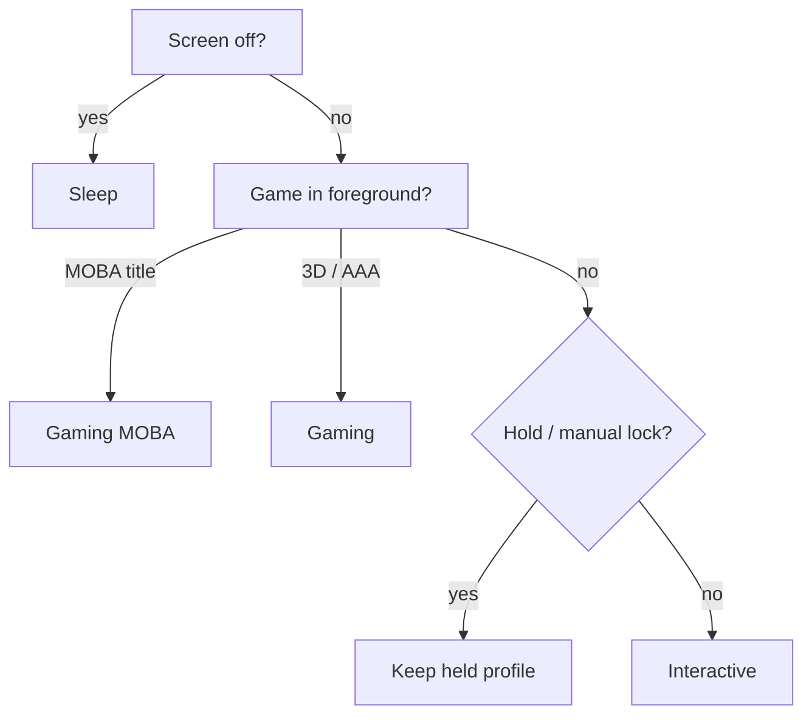
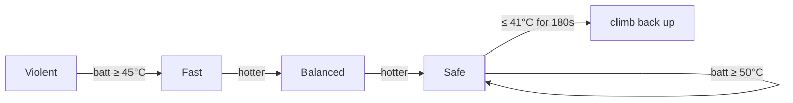
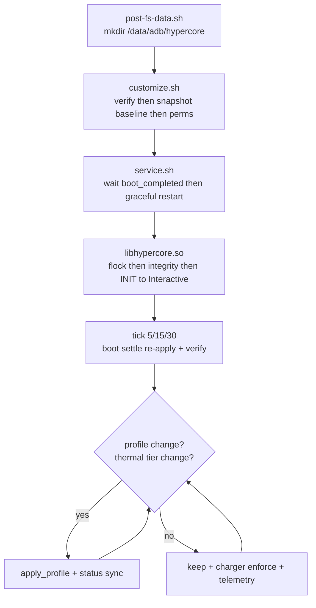

<p align="center">
  
</p>

<h1 align="center">HyperCore</h1>

<p align="center">
  <strong>Universal Dual-Kernel performance & thermal optimizer for MediaTek MT6789 Family</strong><br>
  <i>A lightweight native daemon + Material Design 3 WebUI for Helio G99 / G100 / G200 devices.</i><br>
  <i>Inspired by encore <a href="https://github.com/Rem01Gaming">@Rem01Gaming</a></i>
</p>

<p align="center">
  <a href="https://github.com/itswill00/hypercore/releases"></a>
  <a href="LICENSE"></a>
  
  
  
  
  
  
</p>

<p align="center">
  <a href="#-installation">Installation</a> •
  <a href="#-operational-profiles">Profiles</a> •
  <a href="#-thermal--charging">Thermal</a> •
  <a href="#-hypermoon-hud">HUD</a> •
  <a href="#-webui">WebUI</a> •
  <a href="#-security-model">Security</a> •
  <a href="#-troubleshooting">Troubleshooting</a>
</p>

---

## 📑 Table of Contents

- [Overview](#-overview)
- [Key Features](#-key-features)
- [Operational Profiles](#-operational-profiles)
- [Thermal & Charging](#-thermal--charging)
- [HyperMoon HUD](#-hypermoon-hud)
- [WebUI](#-webui)
- [Security Model](#-security-model)
- [IPC Protocol](#-ipc-protocol)
- [Daemon Lifecycle](#-daemon-lifecycle)
- [Codebase Architecture](#-codebase-architecture)
- [Installation](#-installation)
- [Game List Configuration](#-game-list-configuration)
- [Building from Source](#-building-from-source)
- [Requirements](#-requirements)
- [Troubleshooting](#-troubleshooting)
- [License & Attribution](#-license--attribution)

---

## ✨ Overview

Android devices often suffer frame drops and scrolling stutters from conservative CPU/GPU scaling and governor delays. **HyperCore** runs a native C daemon (`libhypercore.so`) in the background that dynamically tunes — based on real-time workload state:

> CPU governors • uclamp targets • Mali GPU devfreq scaling • MediaTek GED / FPSGO drivers • DVFSRC bandwidth • storage read-ahead • thermal limits • charging current

| | |
| :--- | :--- |
| **What it does** | Kills stutter, stabilizes gaming FPS, cools sustained load, protects the battery — automatically, no manual toggling |
| **How it decides** | Foreground-app scan + screen state + system load → one of 4 profiles, re-evaluated every tick |
| **How it coexists** | Never replaces the kernel thermal stack — it works *alongside* `mi_thermald` / vendor drivers and defers to them when hot |

---

## 🚀 Key Features

<details open>
<summary><b>Core Engine</b></summary>

<br>

| Feature | Description |
| :--- | :--- |
| **Universal Dual-Kernel** | One binary across Linux 5.10 → 6.12+ GKI (Android 12–16), with Cgroup v1 (`/dev/cpuset/`) + v2 (`/sys/fs/cgroup/`) sysfs fallback drivers |
| **Non-blocking loop** | POSIX process management, zero heap allocation in the hot loop, adaptive poll intervals (0.5 s gaming → 8 s sleep) |
| **Read-before-write sysfs** | Every node is read first — no redundant kernel writes, no wakeup spam |
| **Event-driven watchers** | `inotify` on backlight nodes + `netlink` uevents wake the loop early on screen/battery changes |
| **Boot settle (v6.9.4)** | Re-applies Interactive at ticks 5/15/30 to cover late-probing drivers and vendor overwrites, then verifies the result in the log |

</details>

<details>
<summary><b>Performance</b></summary>

<br>

| Feature | Description |
| :--- | :--- |
| **Automated profile switcher** | Sleep / Interactive / Gaming / Gaming MOBA from foreground app + screen + load — fully automatic |
| **MOBA low-latency mode** | Separate frame-pacing tuning (`g_fb_dvfs` / margin) for MLBB-style titles |
| **Mali + GED + FPSGO** | Devfreq governor, polling, GED boost params and FPSGO frame-stabilization per active profile |
| **DVFSRC bandwidth unlock** | Raises interconnect QoS during gaming to remove RAM-bus bottlenecks |
| **Launch boost** | Fresh game launches get temporary read-ahead + notification toast |

</details>

<details>
<summary><b>Thermals & Battery</b></summary>

<br>

| Feature | Description |
| :--- | :--- |
| **3-tier thermal guard** | Hysteresis-guarded CPU ceiling caps; defers to the vendor stack from Tier 1 up |
| **Charging thermal ladder** | Selected mode is a *ceiling* — heat steps it down automatically to a Safe floor |
| **7 charge modes + 16-level slider** | OEM Stock → Violent plus precision hardware slider, night / smart / 80% protection toggles |
| **BMS cycle healing** | Rejects bogus auth-chip cycle counts, syncs the genuine fuel-gauge counter |

</details>

<details>
<summary><b>Experience</b></summary>

<br>

| Feature | Description |
| :--- | :--- |
| **HyperMoon HUD** | Dual-engine overlay (C daemon + Java DEX): FPS, frametime, CPU/GPU, battery watts, network — pill or card, auto-shows in games |
| **Material Design 3 WebUI** | Status, charger control, games, HUD designer, logs, RAM tools — single-file app, no server needed |
| **Zero footprint exit** | Uninstall / daemon stop restores ~60 factory nodes from the captured baseline |

</details>

---

## 🎯 Operational Profiles

The daemon re-evaluates state every tick and applies exactly one profile:

| Profile | Target workload | Little 0–5 | Big 6–7 | GPU gov | GPU range | Touch | `sconfig` |
| :--- | :--- | :--- | :--- | :--- | :--- | :--- | :--- |
| **Sleep** | Screen off | 500 – 1000 MHz | 725 – 850 MHz | `simple_ondemand` | locked 390 MHz | off | `0` |
| **Interactive** | Daily use | stock¹ | stock¹ | stock¹ | stock¹ | smoothing + noise filter | stock¹ |
| **Gaming** | 3D / AAA | 500 – 2000 MHz | 725 – 2200 MHz | `performance` (20 ms) | 390 – 1003 MHz | game + edge | `10` |
| **Gaming MOBA** | Low-latency MOBA | 500 – 2000 MHz | 725 – 2200 MHz² | `performance` (20 ms) | 390 – 1003 MHz | game, no edge | `10` |

> ¹ **Interactive = factory stock + touch.** Every CPU/GPU/GED/FPSGO/VM/cgroup node is restored to the captured `stock_state.conf` — the *only* enhancement is touchscreen smoothing + noise filtering for silky 90/120 Hz scrolling.
> ² MOBA keeps Big at 2.0 GHz under Tier 1 for latency headroom.



---

## 🌡️ Thermal & Charging

### 3-Tier Thermal Guard

HyperCore caps frequency ceilings as heat rises — and from Tier 1 up it **stops fighting the vendor stack** (`mi_thermald`, FPSGO thermal, GPU devfreq cooler) and defers to it.

| Tier | Enter when | Release when | Little cap | Big cap |
| :--- | :--- | :--- | :--- | :--- |
| **Tier 0** — Optimal | batt < 45 °C **and** CPU < 70 °C | — | 2.0 GHz | 2.2 GHz |
| **Tier 1** — Warm | batt ≥ 45 °C **or** CPU ≥ 70 °C | batt ≤ 42 °C **and** CPU ≤ 64 °C | 1.8 GHz | 1.8 GHz |
| **Tier 2** — Hot | batt ≥ 48 °C **or** CPU ≥ 75 °C | batt ≤ 44 °C **and** CPU ≤ 68 °C | 1.4 GHz | 1.5 GHz |

> [!NOTE]
> Hysteresis gaps between enter/release thresholds prevent frequency flutter. No core hotplug, no micro-stutter — only ceiling caps.

### Charge Modes

| # | Mode | Hardware behavior |
| :-: | :--- | :--- |
| 0 | **OEM Stock** | Hands-off — vendor stack owns everything, zero daemon writes |
| 1 | **Fast Charge** | `limit=0` (~3.9 A) |
| 2 | **Balanced** | `limit=10` (~2.3 A / ~9.3 W) — cool gaming/usage pick |
| 3 | **Safe Mode** | `limit=14` (~0.73 A) — overnight / GPS pick |
| 4 | **Bypass Mode** | `input_suspend=1` — true 0 mA passthrough, exempt from ladder |
| 5 | **Violent Charge** | Full factory speed (19–33 W), thermal limits off — acknowledge the risk |
| 6 | **Custom Slider** | 16 hardware levels (0–15) with live mA/W feedback |

### Charging Thermal Ladder

Your selected mode is a **ceiling, never a guarantee**:



- One rung down at **≥ 45 °C** (`Violent → Fast → Balanced → Safe`)
- Hard floor to **Safe at ≥ 50 °C**, climbs back only after **≤ 41 °C for 180 s** continuous
- Dead-band 41–45 °C freezes position (no flapping)
- `OEM Stock` and `Bypass` are **exempt**
- Extras: 80% cutoff with 77% release hysteresis • Bypass low-battery 10/12% hysteresis • TCPC pulse for USB-PD renegotiation

---

## 🌕 HyperMoon HUD

Native dual-engine overlay — near-zero overhead, no extra module needed:

```text
hypermoon_d (C daemon, 11 chars for pkill -x)  →  collects FPS / CPU / GPU / batt / net
HyperMoonOverlay (Java DEX via app_process)    →  draws floating pill / card
```

- **Metrics:** FPS, frametime, CPU load + freq + governor, GPU load + freq + governor, RAM, ZRAM, battery W/temp, network throughput
- **Layouts:** horizontal pill ↔ vertical card • Minimal / Compact / Detailed one-tap presets • Cyber Neon, AMOLED Dark, Matrix Green, Crimson Red + custom hex
- **Auto-gaming:** appears in games, hides in daily use • sub-ms config sync via kernel `inotify`
- **Positioning:** drag with a finger on Android ≤14, or WebUI D-pad + X/Y sliders on any version — required on Android 14 QPR3+/15 where the overlay runs on a hardware surface with no input channel
- **Geometry:** width, height, scale, font, radius, opacity, refresh interval — all live sliders

---

## 🖥️ WebUI

Single-file Vue 3 + Pinia app (`webroot/index.html`) served by your root manager — AMOLED MD3 interface, no backend server:

| Tab | What you get |
| :--- | :--- |
| **Home** | Live daemon status, profile, temps, one-tap HUD toggle |
| **Charger** | 16-level slider, mode presets, protection toggles, live mA/V/W |
| **Games** | Auto-detect scanner, per-title Gaming/MOBA mapping, 2-tap delete guard |
| **HUD** | Full HyperMoon designer with live preview |
| **Logs** | Daemon log viewer + one-tap bugreport export (`hypercore-bugreport`) |
| **About** | Version, baseline info, links |

> [!TIP]
> Telemetry is written atomically (`tmp` + `rename`) so the dashboard never flickers mid-update.

---

## 🔒 Security Model

> [!WARNING]
> A kernel module runs as root. HyperCore treats every install like hostile input:

1. **Two-layer integrity** — `customize.sh` runs `sha256sum -c checksums.txt` over the *entire* payload **before sourcing or executing anything**, then the daemon re-verifies from an embedded checksum table (`--verify-integrity`). `libhypercore.so` can't embed its own hash, so it's covered by the shipped manifest.
2. **IPC authorization** — `/dev/hypercore.sock` checks every peer with `SO_PEERCRED`: only **uid 0** (root bridges, bugreport) and **uid 2000** (adb shell). Strangers are dropped *before* the daemon reads a byte.
3. **Single instance** — advisory `flock` on `<data_dir>/.hypercore_lock`; the kernel releases it even on `SIGKILL`.
4. **Hygiene** — logs/telemetry live in `/data/adb/hypercore/` (never world-readable `/sdcard`), shell calls are quoted against injection, socket reads loop to newline under a 25 ms timeout.

---

## 🔌 IPC Protocol

Talk to the live daemon straight from adb shell:

```bash
echo GET_STATUS | nc -U /dev/hypercore.sock
echo SET_PROFILE:GAMING | nc -U /dev/hypercore.sock
```

| Command | Effect |
| :--- | :--- |
| `GET_STATUS` / `STATUS` | Full JSON telemetry (profile, temps, loads, charge + thermal state) |
| `SET_PROFILE:AUTO` | Back to autonomous profiling |
| `SET_PROFILE:SLEEP` / `INTERACTIVE` / `GAMING` / `MOBA` | Manual lock (persists until `AUTO`) |
| `SET_CHARGE_MODE:0-6` | Charge preset (see table above) |
| `SET_CHARGE_LIMIT:0-15` | Custom slider level (activates mode 6) |
| `GET_CHARGE_MODE` | Current + effective charge state |
| `SET_NIGHT_CHARGING:0\|1` / `SET_SMART_CHG:0\|1` / `SET_PROTECT_80:0\|1` | Battery protection toggles |
| `PURGE_RAM` / `CLEAR_CACHE` | `drop_caches` + memory compaction |
| `PING` | → `PONG` (liveness) |

Live mirror files: `/dev/hypercore.sock` • `/dev/hypercore_status.json` • `/data/adb/hypercore/status.json`

---

## 🔄 Daemon Lifecycle



- **Install** (`customize.sh`): strict MT6789 check (GED + Mali + FPSGO) → kill old daemon → preserve `*.conf` + merge gamelist → `unzip` → **verify first** → capture `stock_state.conf` → permissions + PATH symlinks → game auto-detect.
- **Boot** (`service.sh`): waits `sys.boot_completed` → `SIGTERM` + 10 s grace (lets ~60 nodes restore) → `SIGKILL` fallback → start daemon (+ `nohup` retry) → optional HUD autostart.
- **Uninstall** (`uninstall.sh`): `SIGTERM` + 5 s grace → restore factory nodes from baseline → remove symlinks, socket, data.

---

## 🏗️ Codebase Architecture

```text
src/
├── include/
│   ├── charger.hpp              # 7 charge modes, ladder + hysteresis API
│   ├── common.hpp               # hw_nodes / core_state / stock_baseline structs
│   ├── cpu.hpp                  # Profile matrix + governor/freq API
│   ├── embedded_checksums.hpp   # GENERATED — SHA-256 table (do not hand-edit)
│   ├── gamelist.hpp             # Foreground game detector + PID cache
│   ├── gpu.hpp                  # GED / FPSGO / Mali devfreq API
│   ├── integrity.hpp            # Embedded integrity-check API
│   ├── io.hpp                   # Read-ahead, nr_requests, IRQ affinity
│   ├── ipc.hpp                  # UNIX socket protocol
│   ├── log.hpp                  # Leveled logging + rotation
│   ├── memory.hpp               # Swappiness, VM, ZRAM, purge
│   ├── sha256.hpp               # SHA-256 implementation
│   ├── sysfs.hpp                # Dual-kernel sysfs I/O + touch rediscovery
│   └── thermal.hpp              # Zone scoring, 3-tier guard
├── hud/
│   ├── hypermoon_daemon.c       # C telemetry collector (hypermoon_d)
│   └── HyperMoonOverlay.java    # DEX overlay renderer
├── main.c                       # init, boot settle, adaptive main loop
├── cpu.c                        # build_profile_matrix() + apply_profile()
├── charger.c                    # Ladder, 16-level slider, BMS healing
├── thermal.c                    # Tier engine + gaming bypass (Tier 0 only)
├── gamelist.c                   # cgroup top-app scan, hourly pm fallback
├── ipc.c                        # SO_PEERCRED socket + atomic status.json
├── sysfs.c                      # Read-before-write, stock baseline save/load
├── integrity.c / sha256.c       # Manifest verification primitives
├── io.c / memory.c / gpu.c      # Storage, VM and GPU tuning
└── log.c                        # Persistent FD, 512 KB / 250-line rotation
webui/  →  Vue 3 + Pinia SPA  →  webroot/index.html (single file)
```

---

## 📦 Installation

1. Download **`HyperCore-v6.9.4-b6940-Unified.zip`** from the [Releases page](https://github.com/itswill00/hypercore/releases)
2. Flash it in **KernelSU / APatch / Magisk**
3. **Reboot** — the daemon starts automatically and settles into Interactive
4. Open the manager's **WebUI** to monitor, add games, tune charging and design your HUD

Verify a running install any time (uid 0 / adb shell):

```bash
cd /data/adb/modules/hypercore && sha256sum -c checksums.txt
/data/adb/modules/hypercore/system/bin/libhypercore.so --verify-integrity /data/adb/modules/hypercore
```

---

## 🎮 Game List Configuration

Manage via **WebUI → Games**, or edit `/data/adb/hypercore/gamelist.txt` (survives updates — entries are merged, never overwritten):

```text
# Configured Games
com.mobile.legends:Gaming MOBA
com.tencent.ig:Gaming
com.miHoYo.GenshinImpact:Gaming
com.dts.freefireth:Gaming
```

- Flash-time auto-detect scans `pm list packages -3` for known titles
- Runtime detection prefers cgroup `top-app` scan (up to 64 PIDs), `dumpsys window` as 10 s rate-limited fallback
- New launches trigger a temporary boost + toast

---

## 🔨 Building from Source

Compiles the C daemon, rebuilds the WebUI, regenerates checksums (two-pass: stub → hash → embed → relink → manifest gate) and packages the release ZIP:

```bash
./build.sh
```

Output:

```text
~/HyperCore_Releases/HyperCore-v6.9.4-b6940-Unified.zip
```

| Tool | Needed for |
| :--- | :--- |
| `clang` | `libhypercore.so` + `hypermoon_d` (`-O3 -Werror`) |
| `node` / `npm` | WebUI (`vite build` → single file) |
| `zip` | Release packaging |
| `ecj` + `dx`/`d8` | *Optional* — HyperMoon DEX (skipped gracefully if absent) |

Deploy straight to the live device (root) after building:

```bash
./build.sh --deploy
```

---

## ✅ Requirements

- [x] **Platform** — MediaTek MT6789 Family (Helio G99 / G100 / G200, Mali-G57 + GED + FPSGO)
- [x] **Kernel** — GKI Linux 5.10 → 6.12+ (Android 12 → 16), ARM64
- [x] **Root** — KernelSU, APatch, or Magisk
- [ ] Everything else — Samsung / Snapdragon / Unisoc / Tensor are **not supported** (installer aborts)

---

## 🛠️ Troubleshooting

<details>
<summary><b>Flash aborts with "File tampering or corruption detected"</b></summary>

<br>

- Flash the **release ZIP**, not the source-code ZIP — build artifacts (`libhypercore.so`, `hypermoon_d`, `webroot/index.html`) are git-ignored, so a raw checkout can never pass the manifest.
- Always package with `./build.sh` — hand-zipped archives miss `checksums.txt` entries.
- Re-download if the ZIP was edited or partially copied.

</details>

<details>
<summary><b>After reboot it says Interactive but doesn't feel applied</b></summary>

<br>

Fixed in **v6.9.4**: the daemon now re-applies Interactive at boot-settle ticks and verifies the result. Check the proof in the log:

```bash
grep -i "boot settle" /data/adb/hypercore/hypercore.log
# Boot settle re-apply Interactive (1/3) … (2/3) … verified: Interactive fully applied
```

</details>

<details>
<summary><b>Frequencies stuck below stock while "Interactive"</b></summary>

<br>

- Tier 1/2 thermal guard caps ceilings by design — check `thermal_tier` in `status.json`.
- From Tier 1 up the daemon defers to `mi_thermald`; vendor clamps are expected, not a bug.
- If cool (Tier 0) and still capped, another module may be fighting over `scaling_max_freq`.

</details>

<details>
<summary><b>WebUI shows stale / flickering data</b></summary>

<br>

- The WebUI reads `status.json` first, then the IPC socket, then sysfs directly. Restart the daemon via WebUI (**About → Restart**) or re-flash.
- `echo PING | nc -U /dev/hypercore.sock` should answer `PONG` — silence means the daemon isn't running (`pidof libhypercore.so` to confirm).

</details>

---

## 📜 License & Attribution

This project is licensed under the **GNU General Public License v3.0** — see [`LICENSE`](LICENSE) and [`NOTICE.md`](NOTICE.md) for details.

Developed by **[@itswill00](https://github.com/itswill00)** · Inspired by encore **[@Rem01Gaming](https://github.com/Rem01Gaming)**

<p align="center">
  <a href="#-hypercore">Back to top</a>
</p>
